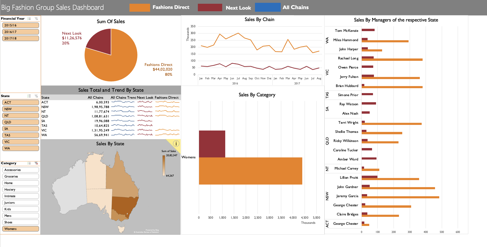

# Big Fashion Group Sales Dashboard 📊

## 📋 Overview

A comprehensive sales analytics dashboard for Big Fashion Group's retail chains (Fashions Direct and Next Look) across Australia, providing detailed insights into regional performance, category sales, and manager-wise analysis.

## 🖼️ Screenshot

### Main Dashboard View

## 🎯 Features

- Sum of Sales Distribution by Chain

  - Fashions Direct: 80% market share ($44.02M)
  - Next Look: 20% market share ($11.26M)

- Multi-dimensional Analysis
  - Sales by State
  - Sales by Category
  - Sales by Chain
  - Manager Performance Tracking

## 📊 Data Visualization Components

1. **Pie Chart**: Chain-wise sales distribution
2. **Line Graph**: Sales trends by chain over time
3. **Australian Map**: Geographic sales distribution
4. **Bar Charts**:
   - Sales by category 
   - Manager-wise sales performance by state

## 🗺️ Geographic Coverage

- ACT (Australian Capital Territory)
- NSW (New South Wales)
- NT (Northern Territory)
- QLD (Queensland)
- SA (South Australia)
- TAS (Tasmania)
- VIC (Victoria)
- WA (Western Australia)

## 📁 Product Categories

- Accessories
- Groceries
- Home
- Hosiery
- Intimate
- Juniors
- Kids
- Mens
- Shoes
- Womens

## 🔍 Key Metrics Tracked

- Total Sales Volume
- State-wise Performance
- Category Performance
- Manager Sales Performance
- Year-over-Year Trends (2015-2018)

## 💻 Technical Details

- Built using Microsoft Excel
- Interactive filtering capabilities:
  - Financial Year selection
  - State filter
  - Category filter

## 📝 Notes

- All sales figures are in thousands (K) or millions (M)
- Historical data available from 2015/16 onwards
- Trends show comparative performance between chains

## 📝 Acknowledgment

This dashboard was created as a practice exercise, inspired by a tutorial from MyOnlineTrainingHub ([Tutorial Link](https://www.youtube.com/watch?v=K74_FNnlIF8)). It is developed as a learning experience in data visualization and dashboard creation.

---
