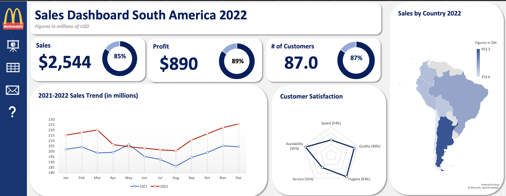
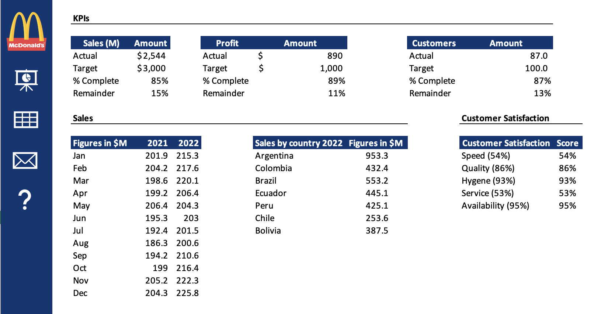
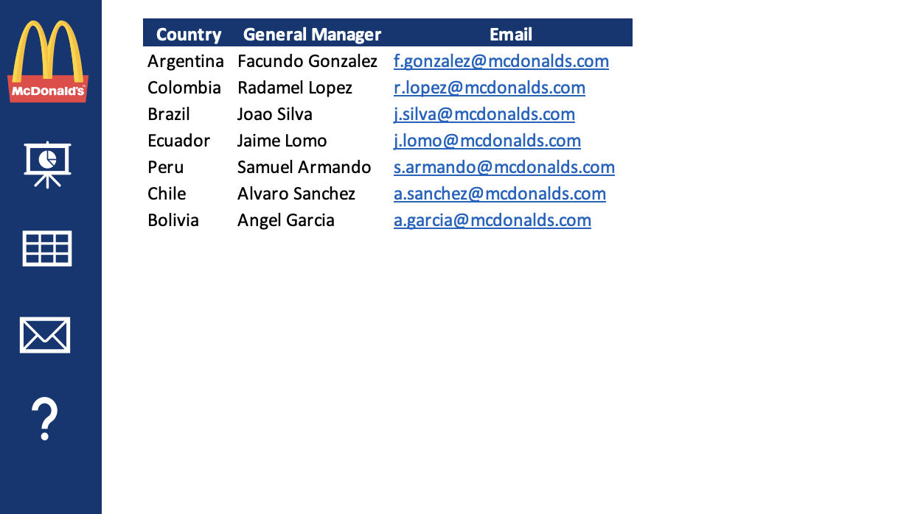

# McDonald's South America Sales Dashboard 2022 📊

This dashboard presents data and insights from McDonald's South America operations for the year 2022, providing a comprehensive overview of sales, customer satisfaction, and key metrics from various South American countries.

## 📈 Overview

The Sales Dashboard provides key data points for 2021-2022, including:

- Sales figures in millions of USD
- Number of customers served
- Customer satisfaction ratings across various categories

### **Key Metrics**

| KPI                   | Value   |
| --------------------- | ------- |
| Sales (M)             | $2,544M |
| Target Sales (M)      | $3,000M |
| Sales Completion (%)  | 85%     |
| Number of Customers   | 953.3M  |
| Profit (M)            | $890M   |
| Target Profit (M)     | $1,000M |
| Profit Completion (%) | 89%     |
| Customer Satisfaction | 87%     |

## 🖼️ Screenshots

### Main Dashboard View

### Data Input Information

### Contact Information

## 💻 Technical Details

- Built using Microsoft Excel

## 📝 Acknowledgment

This dashboard was created as a practice exercise, inspired by a tutorial from Kenji Explains ([Tutorial Link](https://www.youtube.com/watch?v=jeYjtEX3RAE)). This is my first dashboard project, developed as a learning experience in data visualization and dashboard creation.
