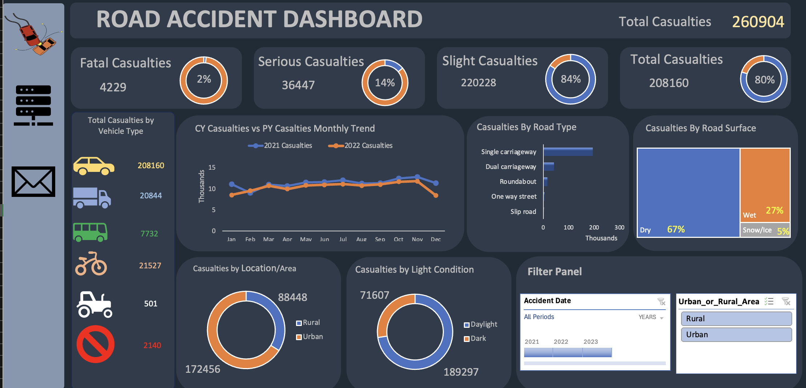

# Road Accident Dashboard 🚗

## 📋 Overview

A comprehensive dashboard analyzing road accidents and casualties across different parameters, helping identify trends and patterns in road safety data. The dashboard currently tracks 260,904 total casualties and provides detailed breakdowns across various dimensions.

## 🖼️ Screenshot

### Main Dashboard View

## 🎯 Key Metrics

- **Total Casualties**: 260,904
- **Severity Breakdown**:
  - Fatal Casualties: 4,229 (2%)
  - Serious Casualties: 36,447 (14%)
  - Slight Casualties: 220,228 (84%)

## 📊 Dashboard Components

### 1. Casualty Severity Analysis

- Three donut charts showing distribution of:
  - Fatal casualties
  - Serious casualties
  - Slight casualties
- Total casualties summary with percentage breakdowns

### 2. Vehicle Type Analysis

Total Casualties by Vehicle Type:

- Cars: 208,160
- Van: 20,844
- Buses: 7,732
- Bicycles: 21,527
- Agricultural Vehicles: 501
- Other: 2,140

### 3. Temporal Analysis

- Monthly trend comparison between Current Year (CY) and Previous Year (PY)
- Interactive timeline visualization
- Year-over-year comparison capabilities

### 4. Environmental Factors

- **Road Surface Conditions**:

  - Dry: 67%
  - Wet: 27%
  - Snow/Ice: 5%

- **Light Conditions**:
  - Daylight: 189,297
  - Dark: 71,607

### 5. Geographic Analysis

- **Location Distribution**:
  - Urban: 88,448
  - Rural: 172,456
- Detailed breakdown by road types:
  - Single carriageway
  - Dual carriageway
  - Roundabout
  - One-way street
  - Slip road

## 🔍 Filtering Capabilities

- **Date Range Selection**:
  - Year selection (2021-2023)
  - Monthly granularity
- **Geographic Filters**:
  - Urban/Rural area selection
- **Custom Filter Panel** for detailed analysis

## 💻 Technical Details

- Built using Excel
- Dark theme for better visibility
- Interactive elements throughout

## 👥 Target Users

- Road Safety Officials
- Traffic Management Teams
- Policy Makers
- Road Safety Researchers
- Urban Planners

## 📝 Acknowledgment

This dashboard was created as a practice exercise, inspired by a tutorial from Data Tutorials ([Tutorial Link](https://www.youtube.com/watch?v=XeWfLNe3moM)). This is my first dashboard project, developed as a learning experience in data visualization and dashboard creation.

---
