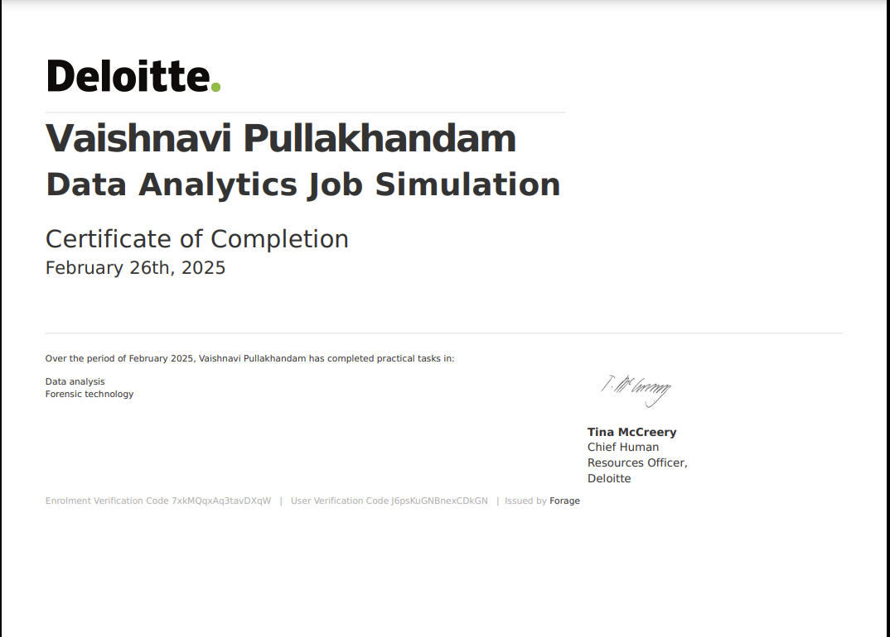

# Unhealthy Machines in Factories of Daikibo Data Analysis with Tableau

This project presents an interactive dashboard created with Tableau to analyze downtimes of machines in four factories of Daikibo.

- Daikibo Factory Meiyo (Tokyo, Japan)
- Daikibo Factory Seiko (Osaka, Japan)
- Daikibo Berlin (Berlin, Germany)
- Daikibo Shenzhen (Shenzhen, China)

Each location has 9 types of machines, sending a message every 10 mins. Daikibo has been collecting this data for one month (May 2021) and they've shared this data in the form of a single JSON file.

The reason the client wanted to collect telemetry was to answer 2 questions:

In which location did machines break the most?
What are the machines that broke most often in that location?

### Overview

This dashboard shows machine downtime per factory and device type. The "Down_Time_Per_Factory" section highlights the unhealthy downtime across different factory locations, while the "Down_Time_Per_Device_Type" section shows which device types experienced the most downtime. The color scale on the right indicates the severity of unhealthy downtime.

### Image

### Tableau

This is the Tableau Dashboard that I have created using the data. Look at the Dashboard here [Dashboard](https://public.tableau.com/app/profile/vaishnavi.pullakhandam/viz/Deloitte_JobSim/Dashboard?publish=yes)

### Conclusion

- The location where machines broke the most is daikibo-factory-seiko.
- The machine that broke most often in that location is the LaserWelder.

### Acknowledgment

A big thank you to Deloitte Australia and Forage for the opportunity to work on Project SIM. This project provided invaluable insights into real-world problem-solving and enhanced my skills in data analysis and decision-making. I truly appreciate the chance to learn and grow through this experience.

